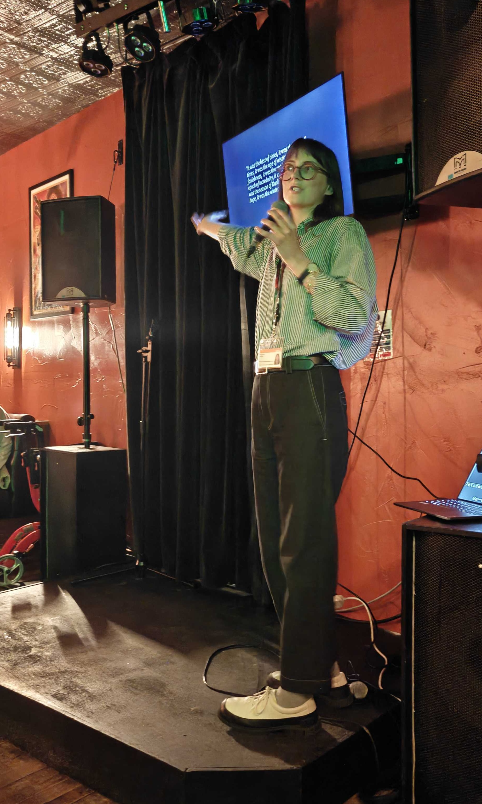

:::{#hero-heading}

{.hero-float-img}

Hi, I'm Bea. I'm a postdoc in the [Centre for Advanced Spatial Analysis](https://www.ucl.ac.uk/bartlett/casa) (CASA) at UCL, where I work on the AI for Collective Intelligence (AI4CI) project. I use machine learning methods to understand what is being constructed in London and its implications for the housing crisis.

My research interests include applied machine learning, mathematical modelling, data analysis, public policy, science communication and (unrelatedly) knitting.

### Education

University College London, London 
PhD Computer Science | Feb 2021 - Sept 2024

University of Warwick, Warwick 
MMath Mathematics | Sept 2016 - June 2020

### Current stuff

- 2025-26 I lecture Quantitative Methods - a course on CASA's Urban Spatial Science MSc
- 2026 UCL Public Policy Knowledge Broker Fellow

### Past stuff

- 2021-24 I completed my PhD in the Computer Science department at UCL, within the Centre for Medical Image Computing. My PhD work focussed on the development and application of ML & disease progression models to improve understanding of the rarer dementias
- 2023 PhD placement: project assistant on the Royal Institution's Christmas Lectures, *The Truth about AI*, presented by Mike Wooldridge
- 2024 PhD placement: research assistant at the policy think tank The Autonomy Institute, researching regional patterns of underdiagnosis
- 2021-23 Edited and illustrated [Chalkdust](https://chalkdustmagazine.com/) magazine

:::
