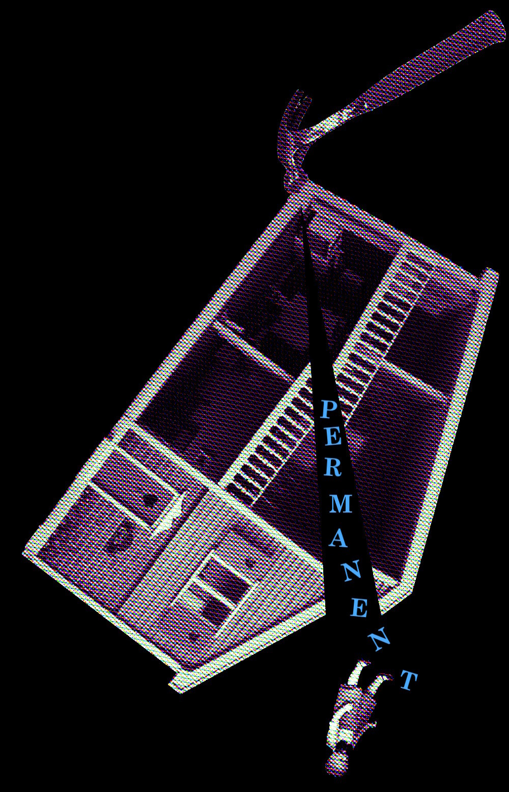
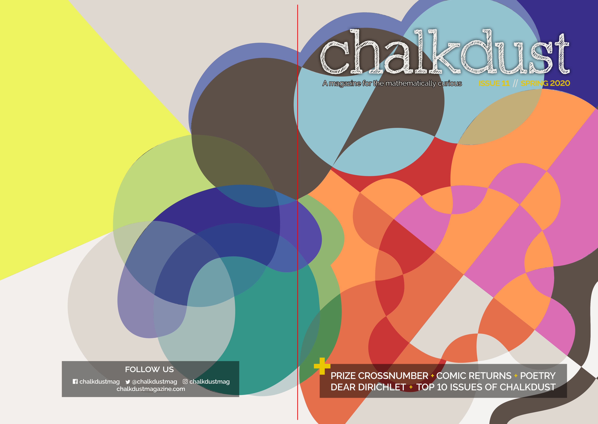
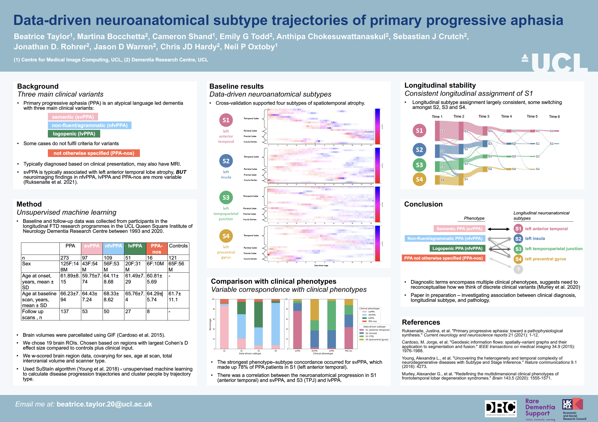

::: {.content-container}
::: {.bento-mosaic}

::: {.bento-tile .bento-tile-small}

:::

::: {.bento-tile .bento-tile-portrait}

:::

::: {.bento-tile .bento-tile-text}
*Hi and welcome!* 
I'm Bea, a postdoctoral researcher in the Centre for Advanced Spatial Analysis at UCL. 
:::

::: {.bento-tile .bento-tile-small}

:::

::: {.bento-tile .bento-tile-portrait}

:::

::: {.bento-tile .bento-tile-landscape}

:::

::: {.bento-tile .bento-tile-hero}

:::

::: {.bento-tile .bento-tile-portrait}

:::

<!-- ::: {.bento-tile .bento-tile-hero}

::: -->

:::
:::

<!-- ::: {.header-text}
::: {.content-container}
::: {.header-block}
Hi and welcome! I'm Bea, a postdoc at UCL. Here you can read about some of the recent things I've been working on.
:::
:::
::: -->

<!-- ::: {.content-container}
::: {.listing-block}

<a href="latest_content.qmd">

## Latest content
</a>

::: {#latest-content}
:::
:::
:::

::: {.content-container}
::: {.listing-block}

<a href="https://github.com/Bea-Taylor" target="_blank" rel="noopener">

## Featured projects
</a>

<a href="https://github.com/Bea-Taylor" target="_blank" rel="noopener">View all projects on GitHub →</a>

:::
:::

::: {.content-container}
::: {.listing-block}

<a href="https://scholar.google.com/citations?user=RPKzlgoAAAAJ&hl=en" target="_blank" rel="noopener">

## Featured publications
</a>

<a href="https://scholar.google.com/citations?user=RPKzlgoAAAAJ&hl=en" target="_blank" rel="noopener">View all publications on Google Scholar →</a>

:::
:::

 -->
